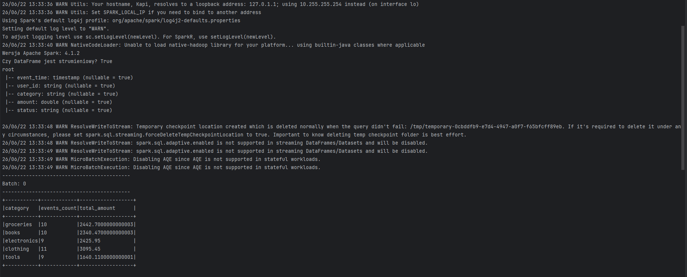
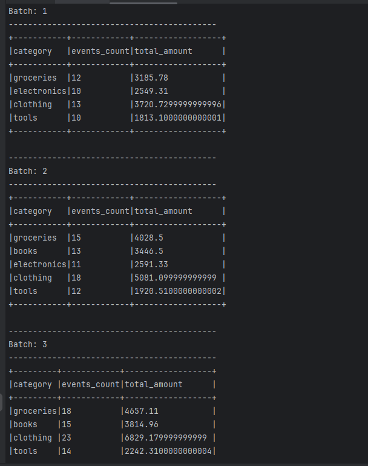

# Raport z Laboratorium 11: Apache Spark Structured Streaming

## Zadanie 1 i 2: Przygotowanie środowiska i wczytywanie danych
Aplikacja została uruchomiona z wykorzystaniem lokalnej sesji Spark. 
Zdefiniowano schemat dla danych wejściowych, a strumień został prawidłowo zainicjowany. Funkcja `isStreaming` zwraca wartość `True`, co potwierdza charakter strumieniowy DataFrame.

## Zadanie 3: Transformacje i agregacje strumieniowe
Zaimplementowano własny generator danych w języku Python dodający nowe pliki CSV co 5 sekund do folderu wejściowego. Spark wykrywa te zmiany bez restartu, aktualizując tabelę w konsoli dzięki trybowi `update`.

## Zadanie 4: Okna czasowe i watermarking
Do strumienia dodano watermarking z tolerancją 1 minuty na spóźnione dane.

- **Okna stałe (Tumbling):** Przedziały czasu, które nie nachodzą na siebie. Każde zdarzenie należy tylko do jednego okna.
- **Okna przesuwające (Sliding):** Przedziały zachodzące na siebie. Zdarzenie może być liczone w wielu oknach jednocześnie.
- **Czas zdarzenia a przetwarzania:** Czas zdarzenia to moment wygenerowania transakcji, a czas przetwarzania to chwila, w której Spark odczytuje rekord. Watermarking pozwala zignorować rekordy, które przyszły z ogromnym opóźnieniem w stosunku do czasu zdarzenia.

## Zadanie 5: Zapis wyników i checkpointing
Wyniki agregacji w oknach czasowych są zapisywane strumieniowo do formatu Parquet w trybie `append`.

- **Batch vs Streaming:** Batch operuje na zamkniętym zbiorze danych od początku do końca. Streaming działa bez przerwy, przetwarzając na bieżąco małe pakiety (mikro-batche) danych.
- **Tryby wyjścia:** `append` dodaje tylko całkowicie nowe rekordy (konieczne przy zapisie do plików), `update` aktualizuje istniejące wartości w konsoli, a `complete` wypisuje zawsze całą tabelę od nowa.
- **Checkpointing:** Mechanizm zapewniający odporność na awarie. Spark zapisuje na dysku specjalne logi i "zakładki" (offsety), dzięki którym po restarcie aplikacji nie przetwarza starych danych od nowa, tylko kontynuuje od miejsca przerwania.